# 05 — Mapa de Dependências

Extraído automaticamente das fórmulas do ficheiro gerado (`src/gen_docs.py`).

## Fluxo de dados (visão de alto nível)

```mermaid
flowchart LR
  subgraph INPUT
    S_00_CONFIGURA__O["00_CONFIGURAÇÃO"]
    S_01_PLANO_CONTAS["01_PLANO_CONTAS"]
    S_01A_TABELAS["01A_TABELAS"]
    S_01B_TERCEIROS["01B_TERCEIROS"]
    S_02_DI_RIO_LAN_AMENTOS["02_DIÁRIO_LANÇAMENTOS"]
    S_16_OR_AMENTO_EMPRESARIAL["16_ORÇAMENTO_EMPRESARIAL"]
    S_11_FISCALIDADE_AGT["11_FISCALIDADE_AGT"]
  end
  subgraph LIVROS
    S_03_DI_RIO_GERAL["03_DIÁRIO_GERAL"]
    S_04_RAZ_O["04_RAZÃO"]
    S_05_CAIXA["05_CAIXA"]
    S_06_BANCOS["06_BANCOS"]
    S_07_CLIENTES["07_CLIENTES"]
    S_08_FORNECEDORES["08_FORNECEDORES"]
    S_09_INVENT_RIOS["09_INVENTÁRIOS"]
    S_10_ACTIVOS_FIXOS["10_ACTIVOS_FIXOS"]
  end
  subgraph FISCAL
    S_12_IVA["12_IVA"]
    S_13_FACTURA__O_FISCAL["13_FACTURAÇÃO_FISCAL"]
    S_14_SAFT["14_SAFT"]
    S_15_IMPOSTO_INDUSTRIAL["15_IMPOSTO_INDUSTRIAL"]
    S_34_CALEND_RIO_FISCAL_AGT["34_CALENDÁRIO_FISCAL_AGT"]
  end
  subgraph DEMONSTRAÇÕES
    S_20_BALANCETE["20_BALANCETE"]
    S_21_BALAN_O["21_BALANÇO"]
    S_22_DRE["22_DRE"]
    S_19_FLUXO_DE_CAIXA["19_FLUXO_DE_CAIXA"]
    S_23_DFC["23_DFC"]
  end
  subgraph GESTÃO
    S_17_PLANEAMENTO_FINANCEIRO["17_PLANEAMENTO_FINANCEIRO"]
    S_18_TESOURARIA["18_TESOURARIA"]
    S_24_GEST_O_DE_PROJECTOS["24_GESTÃO_DE_PROJECTOS"]
    S_25_AN_LISE_DE_INVESTIMENTOS["25_ANÁLISE_DE_INVESTIMENTOS"]
    S_26_RISCO_FINANCEIRO["26_RISCO_FINANCEIRO"]
    S_27_SUSTENTABILIDADE["27_SUSTENTABILIDADE"]
    S_28_KPI_FINANCEIROS["28_KPI_FINANCEIROS"]
    S_30_BUDGET_VS_ACTUAL["30_BUDGET_VS_ACTUAL"]
    S_36_BREAK_EVEN["36_BREAK_EVEN"]
  end
  subgraph CONTROLO
    S_31_CONTROLO_INTERNO["31_CONTROLO_INTERNO"]
    S_32_AUDITORIA["32_AUDITORIA"]
    S_33_FECHO_MENSAL["33_FECHO_MENSAL"]
    S_37_ENCERRAMENTO_EXERC_CIO["37_ENCERRAMENTO_EXERCÍCIO"]
    S_39_ALERTAS["39_ALERTAS"]
    S_99_CONTROLO_SISTEMA["99_CONTROLO_SISTEMA"]
  end
  subgraph REPORTE
    S_29_DASHBOARD_EXECUTIVO["29_DASHBOARD_EXECUTIVO"]
    S_38_RELAT_RIO_GEST_O["38_RELATÓRIO_GESTÃO"]
  end
  INPUT --> LIVROS --> DEMONSTRAÇÕES --> GESTÃO --> REPORTE
  INPUT --> FISCAL --> DEMONSTRAÇÕES
  LIVROS --> CONTROLO
  FISCAL --> CONTROLO
  DEMONSTRAÇÕES --> CONTROLO --> REPORTE
```

## Dependências por folha (folhas de que cada folha lê dados)

| Folha | Lê de |
|---|---|
| LEIA-ME | 99_CONTROLO_SISTEMA |
| 00_CONFIGURAÇÃO | — |
| 01_PLANO_CONTAS | 00_CONFIGURAÇÃO, 02_DIÁRIO_LANÇAMENTOS |
| 01A_TABELAS | — |
| 01B_TERCEIROS | 00_CONFIGURAÇÃO, 02_DIÁRIO_LANÇAMENTOS, 07_CLIENTES |
| 02A_OPERAÇÕES | 01A_TABELAS, 02_DIÁRIO_LANÇAMENTOS, 10_ACTIVOS_FIXOS, 11_FISCALIDADE_AGT |
| 02B_MOTOR | 01A_TABELAS, 02A_OPERAÇÕES |
| 02_DIÁRIO_LANÇAMENTOS | 00_CONFIGURAÇÃO, 01_PLANO_CONTAS, 01A_TABELAS, 01B_TERCEIROS, 02B_MOTOR, 03_DIÁRIO_GERAL, 04_RAZÃO, 09_INVENTÁRIOS, 11_FISCALIDADE_AGT, 32_AUDITORIA, 33_FECHO_MENSAL |
| 03_DIÁRIO_GERAL | 00_CONFIGURAÇÃO, 02_DIÁRIO_LANÇAMENTOS |
| 04_RAZÃO | 00_CONFIGURAÇÃO, 01_PLANO_CONTAS, 02_DIÁRIO_LANÇAMENTOS |
| 05_CAIXA | 00_CONFIGURAÇÃO, 02_DIÁRIO_LANÇAMENTOS |
| 06_BANCOS | 00_CONFIGURAÇÃO, 02_DIÁRIO_LANÇAMENTOS |
| 07_CLIENTES | 00_CONFIGURAÇÃO, 01B_TERCEIROS, 02_DIÁRIO_LANÇAMENTOS |
| 08_FORNECEDORES | 00_CONFIGURAÇÃO, 01B_TERCEIROS, 02_DIÁRIO_LANÇAMENTOS |
| 09_INVENTÁRIOS | 00_CONFIGURAÇÃO, 02_DIÁRIO_LANÇAMENTOS |
| 10_ACTIVOS_FIXOS | 00_CONFIGURAÇÃO, 02_DIÁRIO_LANÇAMENTOS |
| 11_FISCALIDADE_AGT | 00_CONFIGURAÇÃO, 02_DIÁRIO_LANÇAMENTOS |
| 12_IVA | 00_CONFIGURAÇÃO, 02_DIÁRIO_LANÇAMENTOS |
| 13_FACTURAÇÃO_FISCAL | 00_CONFIGURAÇÃO, 02_DIÁRIO_LANÇAMENTOS, 14_SAFT |
| 14_SAFT | 00_CONFIGURAÇÃO, 01_PLANO_CONTAS, 01B_TERCEIROS, 02_DIÁRIO_LANÇAMENTOS, 09_INVENTÁRIOS, 11_FISCALIDADE_AGT, 13_FACTURAÇÃO_FISCAL |
| 15_IMPOSTO_INDUSTRIAL | 00_CONFIGURAÇÃO, 02_DIÁRIO_LANÇAMENTOS, 11_FISCALIDADE_AGT, 22_DRE |
| 16_ORÇAMENTO_EMPRESARIAL | 00_CONFIGURAÇÃO, 02_DIÁRIO_LANÇAMENTOS, 10_ACTIVOS_FIXOS, 11_FISCALIDADE_AGT, 21_BALANÇO |
| 17_PLANEAMENTO_FINANCEIRO | 00_CONFIGURAÇÃO, 01A_TABELAS, 11_FISCALIDADE_AGT, 21_BALANÇO, 22_DRE, 23_DFC |
| 18_TESOURARIA | 00_CONFIGURAÇÃO, 02_DIÁRIO_LANÇAMENTOS, 07_CLIENTES, 08_FORNECEDORES, 12_IVA, 16_ORÇAMENTO_EMPRESARIAL, 19_FLUXO_DE_CAIXA |
| 19_FLUXO_DE_CAIXA | 00_CONFIGURAÇÃO, 02_DIÁRIO_LANÇAMENTOS |
| 20_BALANCETE | 00_CONFIGURAÇÃO, 01_PLANO_CONTAS, 02_DIÁRIO_LANÇAMENTOS |
| 21_BALANÇO | 00_CONFIGURAÇÃO, 01_PLANO_CONTAS, 22_DRE |
| 22_DRE | 00_CONFIGURAÇÃO, 02_DIÁRIO_LANÇAMENTOS |
| 23_DFC | 00_CONFIGURAÇÃO, 02_DIÁRIO_LANÇAMENTOS |
| 24_GESTÃO_DE_PROJECTOS | 00_CONFIGURAÇÃO, 02_DIÁRIO_LANÇAMENTOS |
| 25_ANÁLISE_DE_INVESTIMENTOS | 11_FISCALIDADE_AGT |
| 26_RISCO_FINANCEIRO | 00_CONFIGURAÇÃO, 02_DIÁRIO_LANÇAMENTOS, 07_CLIENTES, 11_FISCALIDADE_AGT, 17_PLANEAMENTO_FINANCEIRO, 18_TESOURARIA, 21_BALANÇO, 28_KPI_FINANCEIROS, 34_CALENDÁRIO_FISCAL_AGT |
| 27_SUSTENTABILIDADE | 21_BALANÇO, 22_DRE, 23_DFC, 28_KPI_FINANCEIROS |
| 28_KPI_FINANCEIROS | 00_CONFIGURAÇÃO, 07_CLIENTES, 08_FORNECEDORES, 11_FISCALIDADE_AGT, 21_BALANÇO, 22_DRE |
| 29_DASHBOARD_EXECUTIVO | 00_CONFIGURAÇÃO, 07_CLIENTES, 08_FORNECEDORES, 12_IVA, 15_IMPOSTO_INDUSTRIAL, 18_TESOURARIA, 21_BALANÇO, 22_DRE, 23_DFC, 26_RISCO_FINANCEIRO, 28_KPI_FINANCEIROS, 30_BUDGET_VS_ACTUAL, 39_ALERTAS, 99_CONTROLO_SISTEMA |
| 30_BUDGET_VS_ACTUAL | 00_CONFIGURAÇÃO, 16_ORÇAMENTO_EMPRESARIAL, 22_DRE |
| 31_CONTROLO_INTERNO | 00_CONFIGURAÇÃO, 02_DIÁRIO_LANÇAMENTOS, 05_CAIXA, 06_BANCOS, 07_CLIENTES, 08_FORNECEDORES, 30_BUDGET_VS_ACTUAL, 33_FECHO_MENSAL |
| 32_AUDITORIA | 00_CONFIGURAÇÃO, 01B_TERCEIROS, 02_DIÁRIO_LANÇAMENTOS, 05_CAIXA, 06_BANCOS, 07_CLIENTES, 08_FORNECEDORES, 09_INVENTÁRIOS, 10_ACTIVOS_FIXOS, 13_FACTURAÇÃO_FISCAL |
| 33_FECHO_MENSAL | 00_CONFIGURAÇÃO, 02_DIÁRIO_LANÇAMENTOS, 05_CAIXA, 06_BANCOS, 07_CLIENTES, 08_FORNECEDORES, 09_INVENTÁRIOS, 10_ACTIVOS_FIXOS, 12_IVA, 19_FLUXO_DE_CAIXA, 21_BALANÇO, 22_DRE |
| 34_CALENDÁRIO_FISCAL_AGT | 00_CONFIGURAÇÃO, 02_DIÁRIO_LANÇAMENTOS, 12_IVA, 15_IMPOSTO_INDUSTRIAL |
| 35_BASE_LEGAL | — |
| 36_BREAK_EVEN | 00_CONFIGURAÇÃO, 01A_TABELAS, 22_DRE |
| 37_ENCERRAMENTO_EXERCÍCIO | 00_CONFIGURAÇÃO, 01_PLANO_CONTAS, 22_DRE |
| 38_RELATÓRIO_GESTÃO | 00_CONFIGURAÇÃO, 02_DIÁRIO_LANÇAMENTOS, 07_CLIENTES, 08_FORNECEDORES, 11_FISCALIDADE_AGT, 12_IVA, 13_FACTURAÇÃO_FISCAL, 16_ORÇAMENTO_EMPRESARIAL, 18_TESOURARIA, 19_FLUXO_DE_CAIXA, 21_BALANÇO, 24_GESTÃO_DE_PROJECTOS, 26_RISCO_FINANCEIRO, 27_SUSTENTABILIDADE, 28_KPI_FINANCEIROS, 30_BUDGET_VS_ACTUAL, 34_CALENDÁRIO_FISCAL_AGT, 36_BREAK_EVEN, 99_CONTROLO_SISTEMA |
| 39_ALERTAS | 00_CONFIGURAÇÃO, 01_PLANO_CONTAS, 02_DIÁRIO_LANÇAMENTOS, 05_CAIXA, 06_BANCOS, 07_CLIENTES, 08_FORNECEDORES, 12_IVA, 13_FACTURAÇÃO_FISCAL, 15_IMPOSTO_INDUSTRIAL, 18_TESOURARIA, 21_BALANÇO, 22_DRE, 28_KPI_FINANCEIROS, 30_BUDGET_VS_ACTUAL, 34_CALENDÁRIO_FISCAL_AGT |
| 99_CONTROLO_SISTEMA | 00_CONFIGURAÇÃO, 01_PLANO_CONTAS, 02_DIÁRIO_LANÇAMENTOS, 05_CAIXA, 06_BANCOS, 07_CLIENTES, 08_FORNECEDORES, 09_INVENTÁRIOS, 10_ACTIVOS_FIXOS, 11_FISCALIDADE_AGT, 12_IVA, 13_FACTURAÇÃO_FISCAL, 14_SAFT, 15_IMPOSTO_INDUSTRIAL, 16_ORÇAMENTO_EMPRESARIAL, 19_FLUXO_DE_CAIXA, 20_BALANCETE, 21_BALANÇO, 22_DRE, 23_DFC, 31_CONTROLO_INTERNO, 32_AUDITORIA, 33_FECHO_MENSAL |

## Nomes definidos: origem e utilizadores

| Nome | Folha de origem | Usado em |
|---|---|---|
| `AF_Capex` | 10_ACTIVOS_FIXOS | (interno) |
| `AF_DepEst` | 10_ACTIVOS_FIXOS | 33_FECHO_MENSAL |
| `AF_DepMesReg` | 10_ACTIVOS_FIXOS | 02A_OPERAÇÕES, 16_ORÇAMENTO_EMPRESARIAL |
| `AF_Estado` | 10_ACTIVOS_FIXOS | 32_AUDITORIA, 33_FECHO_MENSAL, 99_CONTROLO_SISTEMA |
| `AGT_Check` | 13_FACTURAÇÃO_FISCAL | (interno) |
| `ALR_Count` | 39_ALERTAS | 29_DASHBOARD_EXECUTIVO |
| `ALR_Red` | 39_ALERTAS | (interno) |
| `AUD_Estado` | 32_AUDITORIA | 99_CONTROLO_SISTEMA |
| `AUD_Limite` | 32_AUDITORIA | 02_DIÁRIO_LANÇAMENTOS |
| `AUD_Media` | 32_AUDITORIA | 02_DIÁRIO_LANÇAMENTOS |
| `BE_CF` | 36_BREAK_EVEN | (interno) |
| `BE_Estado` | 36_BREAK_EVEN | 38_RELATÓRIO_GESTÃO |
| `BE_GAO` | 36_BREAK_EVEN | (interno) |
| `BE_Kz` | 36_BREAK_EVEN | (interno) |
| `BE_MC` | 36_BREAK_EVEN | (interno) |
| `BE_MCp` | 36_BREAK_EVEN | (interno) |
| `BE_MS` | 36_BREAK_EVEN | 38_RELATÓRIO_GESTÃO |
| `BE_Rec` | 36_BREAK_EVEN | (interno) |
| `BE_Un` | 36_BREAK_EVEN | (interno) |
| `BK_Dif` | 06_BANCOS | 31_CONTROLO_INTERNO, 32_AUDITORIA, 33_FECHO_MENSAL |
| `BK_Estado` | 06_BANCOS | 99_CONTROLO_SISTEMA |
| `BK_Pend` | 06_BANCOS | 31_CONTROLO_INTERNO, 32_AUDITORIA |
| `BK_Saldo` | 06_BANCOS | 99_CONTROLO_SISTEMA |
| `BSA_AC` | 21_BALANÇO | (interno) |
| `BSA_ANC` | 21_BALANÇO | (interno) |
| `BSA_AT` | 21_BALANÇO | 28_KPI_FINANCEIROS |
| `BSA_BA_ACRESC` | 21_BALANÇO | (interno) |
| `BSA_BA_APLIC` | 21_BALANÇO | (interno) |
| `BSA_BA_CLIENTES` | 21_BALANÇO | (interno) |
| `BSA_BA_DISP` | 21_BALANÇO | (interno) |
| `BSA_BA_ESTADO` | 21_BALANÇO | (interno) |
| `BSA_BA_EXIST` | 21_BALANÇO | (interno) |
| `BSA_BA_IMOB_CORP` | 21_BALANÇO | 16_ORÇAMENTO_EMPRESARIAL |
| `BSA_BA_IMOB_INC` | 21_BALANÇO | 16_ORÇAMENTO_EMPRESARIAL |
| `BSA_BA_INV_FIN` | 21_BALANÇO | 16_ORÇAMENTO_EMPRESARIAL |
| `BSA_BA_OUTROS_REC` | 21_BALANÇO | (interno) |
| `BSA_BCP_CAPITAL` | 21_BALANÇO | (interno) |
| `BSA_BCP_RESERVAS` | 21_BALANÇO | (interno) |
| `BSA_BCP_RL` | 21_BALANÇO | (interno) |
| `BSA_BCP_RT` | 21_BALANÇO | (interno) |
| `BSA_BPC_ACRESC` | 21_BALANÇO | (interno) |
| `BSA_BPC_EMP` | 21_BALANÇO | 16_ORÇAMENTO_EMPRESARIAL |
| `BSA_BPC_ESTADO` | 21_BALANÇO | (interno) |
| `BSA_BPC_FORN` | 21_BALANÇO | (interno) |
| `BSA_BPC_OUTROS` | 21_BALANÇO | (interno) |
| `BSA_BPNC_EMP` | 21_BALANÇO | 16_ORÇAMENTO_EMPRESARIAL |
| `BSA_BPNC_PROV` | 21_BALANÇO | (interno) |
| `BSA_CP` | 21_BALANÇO | 16_ORÇAMENTO_EMPRESARIAL, 28_KPI_FINANCEIROS |
| `BSA_PC` | 21_BALANÇO | (interno) |
| `BSA_PNC` | 21_BALANÇO | (interno) |
| `BSA_PT` | 21_BALANÇO | (interno) |
| `BS_AC` | 21_BALANÇO | 27_SUSTENTABILIDADE, 28_KPI_FINANCEIROS |
| `BS_ANC` | 21_BALANÇO | (interno) |
| `BS_AT` | 21_BALANÇO | 28_KPI_FINANCEIROS, 99_CONTROLO_SISTEMA |
| `BS_BA_ACRESC` | 21_BALANÇO | 27_SUSTENTABILIDADE |
| `BS_BA_APLIC` | 21_BALANÇO | 17_PLANEAMENTO_FINANCEIRO, 28_KPI_FINANCEIROS, 29_DASHBOARD_EXECUTIVO |
| `BS_BA_CLIENTES` | 21_BALANÇO | 27_SUSTENTABILIDADE |
| `BS_BA_DISP` | 21_BALANÇO | 17_PLANEAMENTO_FINANCEIRO, 28_KPI_FINANCEIROS, 29_DASHBOARD_EXECUTIVO |
| `BS_BA_ESTADO` | 21_BALANÇO | 27_SUSTENTABILIDADE |
| `BS_BA_EXIST` | 21_BALANÇO | 27_SUSTENTABILIDADE, 28_KPI_FINANCEIROS |
| `BS_BA_IMOB_CORP` | 21_BALANÇO | (interno) |
| `BS_BA_IMOB_INC` | 21_BALANÇO | (interno) |
| `BS_BA_INV_FIN` | 21_BALANÇO | (interno) |
| `BS_BA_OUTROS_REC` | 21_BALANÇO | 27_SUSTENTABILIDADE |
| `BS_BCP_CAPITAL` | 21_BALANÇO | (interno) |
| `BS_BCP_RESERVAS` | 21_BALANÇO | (interno) |
| `BS_BCP_RL` | 21_BALANÇO | 99_CONTROLO_SISTEMA |
| `BS_BCP_RT` | 21_BALANÇO | (interno) |
| `BS_BPC_ACRESC` | 21_BALANÇO | 27_SUSTENTABILIDADE |
| `BS_BPC_EMP` | 21_BALANÇO | 17_PLANEAMENTO_FINANCEIRO, 26_RISCO_FINANCEIRO, 28_KPI_FINANCEIROS, 29_DASHBOARD_EXECUTIVO, 38_RELATÓRIO_GESTÃO |
| `BS_BPC_ESTADO` | 21_BALANÇO | 27_SUSTENTABILIDADE |
| `BS_BPC_FORN` | 21_BALANÇO | 27_SUSTENTABILIDADE |
| `BS_BPC_OUTROS` | 21_BALANÇO | 27_SUSTENTABILIDADE |
| `BS_BPNC_EMP` | 21_BALANÇO | 17_PLANEAMENTO_FINANCEIRO, 26_RISCO_FINANCEIRO, 28_KPI_FINANCEIROS, 29_DASHBOARD_EXECUTIVO, 38_RELATÓRIO_GESTÃO |
| `BS_BPNC_PROV` | 21_BALANÇO | (interno) |
| `BS_CP` | 21_BALANÇO | 17_PLANEAMENTO_FINANCEIRO, 26_RISCO_FINANCEIRO, 28_KPI_FINANCEIROS, 99_CONTROLO_SISTEMA |
| `BS_Check` | 21_BALANÇO | 33_FECHO_MENSAL, 99_CONTROLO_SISTEMA |
| `BS_PC` | 21_BALANÇO | 27_SUSTENTABILIDADE, 28_KPI_FINANCEIROS |
| `BS_PNC` | 21_BALANÇO | (interno) |
| `BS_PT` | 21_BALANÇO | 28_KPI_FINANCEIROS, 39_ALERTAS, 99_CONTROLO_SISTEMA |
| `BS_RLCheck` | 21_BALANÇO | (interno) |
| `BT_DiarioEst` | 20_BALANCETE | 99_CONTROLO_SISTEMA |
| `BT_Estado` | 20_BALANCETE | 99_CONTROLO_SISTEMA |
| `BT_Fim` | 20_BALANCETE | (interno) |
| `BT_Ini` | 20_BALANCETE | (interno) |
| `BT_TotC` | 20_BALANCETE | (interno) |
| `BT_TotD` | 20_BALANCETE | (interno) |
| `BT_TotSF` | 20_BALANCETE | (interno) |
| `BVA_Exced` | 30_BUDGET_VS_ACTUAL | 29_DASHBOARD_EXECUTIVO, 38_RELATÓRIO_GESTÃO, 39_ALERTAS |
| `BVA_ExecCustos` | 30_BUDGET_VS_ACTUAL | 29_DASHBOARD_EXECUTIVO, 38_RELATÓRIO_GESTÃO |
| `BVA_RLOrc` | 30_BUDGET_VS_ACTUAL | (interno) |
| `BVA_Red` | 30_BUDGET_VS_ACTUAL | 29_DASHBOARD_EXECUTIVO, 38_RELATÓRIO_GESTÃO, 39_ALERTAS |
| `BVA_Tab` | 30_BUDGET_VS_ACTUAL | (interno) |
| `CAL_AVencer` | 34_CALENDÁRIO_FISCAL_AGT | 39_ALERTAS |
| `CAL_Alerta` | 34_CALENDÁRIO_FISCAL_AGT | (interno) |
| `CAL_Vencidas` | 34_CALENDÁRIO_FISCAL_AGT | 26_RISCO_FINANCEIRO, 38_RELATÓRIO_GESTÃO, 39_ALERTAS |
| `CFG_Ano` | 00_CONFIGURAÇÃO | 01_PLANO_CONTAS, 01B_TERCEIROS, 02_DIÁRIO_LANÇAMENTOS, 04_RAZÃO, 05_CAIXA, 06_BANCOS, 07_CLIENTES, 08_FORNECEDORES, 09_INVENTÁRIOS, 10_ACTIVOS_FIXOS, 11_FISCALIDADE_AGT, 12_IVA, 13_FACTURAÇÃO_FISCAL, 14_SAFT, 15_IMPOSTO_INDUSTRIAL, 16_ORÇAMENTO_EMPRESARIAL, 18_TESOURARIA, 19_FLUXO_DE_CAIXA, 20_BALANCETE, 22_DRE, 23_DFC, 24_GESTÃO_DE_PROJECTOS, 32_AUDITORIA, 33_FECHO_MENSAL, 34_CALENDÁRIO_FISCAL_AGT, 38_RELATÓRIO_GESTÃO, 39_ALERTAS, 99_CONTROLO_SISTEMA |
| `CFG_Anual` | 00_CONFIGURAÇÃO | 09_INVENTÁRIOS, 17_PLANEAMENTO_FINANCEIRO, 28_KPI_FINANCEIROS, 36_BREAK_EVEN |
| `CFG_AumCust` | 00_CONFIGURAÇÃO | 39_ALERTAS |
| `CFG_Caixa1` | 00_CONFIGURAÇÃO | (interno) |
| `CFG_Caixa2` | 00_CONFIGURAÇÃO | (interno) |
| `CFG_Caixa3` | 00_CONFIGURAÇÃO | (interno) |
| `CFG_ConcCli` | 00_CONFIGURAÇÃO | 26_RISCO_FINANCEIRO, 38_RELATÓRIO_GESTÃO, 39_ALERTAS |
| `CFG_ConcForn` | 00_CONFIGURAÇÃO | 39_ALERTAS |
| `CFG_Contactos` | 00_CONFIGURAÇÃO | (interno) |
| `CFG_DataIni` | 00_CONFIGURAÇÃO | 21_BALANÇO |
| `CFG_DataRef` | 00_CONFIGURAÇÃO | 01B_TERCEIROS, 02_DIÁRIO_LANÇAMENTOS, 06_BANCOS, 07_CLIENTES, 08_FORNECEDORES, 09_INVENTÁRIOS, 10_ACTIVOS_FIXOS, 11_FISCALIDADE_AGT, 12_IVA, 18_TESOURARIA, 21_BALANÇO, 22_DRE, 23_DFC, 24_GESTÃO_DE_PROJECTOS, 29_DASHBOARD_EXECUTIVO, 34_CALENDÁRIO_FISCAL_AGT, 38_RELATÓRIO_GESTÃO, 39_ALERTAS, 99_CONTROLO_SISTEMA |
| `CFG_Denom` | 00_CONFIGURAÇÃO | (interno) |
| `CFG_DiaSal` | 00_CONFIGURAÇÃO | 18_TESOURARIA |
| `CFG_Dias` | 00_CONFIGURAÇÃO | 07_CLIENTES, 08_FORNECEDORES, 09_INVENTÁRIOS, 28_KPI_FINANCEIROS |
| `CFG_DiasSemMov` | 00_CONFIGURAÇÃO | 39_ALERTAS |
| `CFG_Dim` | 00_CONFIGURAÇÃO | (interno) |
| `CFG_DivEBITDA` | 00_CONFIGURAÇÃO | 28_KPI_FINANCEIROS, 38_RELATÓRIO_GESTÃO, 39_ALERTAS |
| `CFG_DividaPrev` | 00_CONFIGURAÇÃO | 18_TESOURARIA |
| `CFG_EBITDAN1` | 00_CONFIGURAÇÃO | 28_KPI_FINANCEIROS |
| `CFG_EUR` | 00_CONFIGURAÇÃO | (interno) |
| `CFG_ExpCamb` | 00_CONFIGURAÇÃO | 39_ALERTAS |
| `CFG_Forma` | 00_CONFIGURAÇÃO | (interno) |
| `CFG_FundoFixo` | 00_CONFIGURAÇÃO | 05_CAIXA |
| `CFG_GC` | 00_CONFIGURAÇÃO | 13_FACTURAÇÃO_FISCAL |
| `CFG_IniDep` | 00_CONFIGURAÇÃO | 10_ACTIVOS_FIXOS |
| `CFG_LimTes` | 00_CONFIGURAÇÃO | 18_TESOURARIA, 26_RISCO_FINANCEIRO |
| `CFG_MargMin` | 00_CONFIGURAÇÃO | 28_KPI_FINANCEIROS, 38_RELATÓRIO_GESTÃO, 39_ALERTAS |
| `CFG_MesRep` | 00_CONFIGURAÇÃO | 01_PLANO_CONTAS, 03_DIÁRIO_GERAL, 04_RAZÃO, 05_CAIXA, 10_ACTIVOS_FIXOS, 12_IVA, 15_IMPOSTO_INDUSTRIAL, 18_TESOURARIA, 19_FLUXO_DE_CAIXA, 20_BALANCETE, 22_DRE, 23_DFC, 30_BUDGET_VS_ACTUAL, 31_CONTROLO_INTERNO, 33_FECHO_MENSAL, 34_CALENDÁRIO_FISCAL_AGT, 37_ENCERRAMENTO_EXERCÍCIO, 38_RELATÓRIO_GESTÃO, 39_ALERTAS, 99_CONTROLO_SISTEMA |
| `CFG_Moeda` | 00_CONFIGURAÇÃO | 02_DIÁRIO_LANÇAMENTOS, 14_SAFT |
| `CFG_Municipio` | 00_CONFIGURAÇÃO | (interno) |
| `CFG_NIF` | 00_CONFIGURAÇÃO | 14_SAFT |
| `CFG_NIFCF` | 00_CONFIGURAÇÃO | 01B_TERCEIROS, 02_DIÁRIO_LANÇAMENTOS |
| `CFG_Nome` | 00_CONFIGURAÇÃO | 14_SAFT, 29_DASHBOARD_EXECUTIVO, 38_RELATÓRIO_GESTÃO |
| `CFG_OrcTol` | 00_CONFIGURAÇÃO | 30_BUDGET_VS_ACTUAL |
| `CFG_PMPalvo` | 00_CONFIGURAÇÃO | 28_KPI_FINANCEIROS, 38_RELATÓRIO_GESTÃO |
| `CFG_PMRalvo` | 00_CONFIGURAÇÃO | 28_KPI_FINANCEIROS, 38_RELATÓRIO_GESTÃO |
| `CFG_Plano` | 00_CONFIGURAÇÃO | (interno) |
| `CFG_ProbCob` | 00_CONFIGURAÇÃO | 18_TESOURARIA |
| `CFG_Provincia` | 00_CONFIGURAÇÃO | (interno) |
| `CFG_QuedaRec` | 00_CONFIGURAÇÃO | 39_ALERTAS |
| `CFG_RegII` | 00_CONFIGURAÇÃO | (interno) |
| `CFG_RegIVA` | 00_CONFIGURAÇÃO | (interno) |
| `CFG_SalMin` | 00_CONFIGURAÇÃO | (interno) |
| `CFG_SalPrev` | 00_CONFIGURAÇÃO | 18_TESOURARIA |
| `CFG_SaldoMin` | 00_CONFIGURAÇÃO | 17_PLANEAMENTO_FINANCEIRO, 18_TESOURARIA, 38_RELATÓRIO_GESTÃO, 39_ALERTAS |
| `CFG_Sector` | 00_CONFIGURAÇÃO | (interno) |
| `CFG_Sede` | 00_CONFIGURAÇÃO | (interno) |
| `CFG_TipoEnt` | 00_CONFIGURAÇÃO | (interno) |
| `CFG_Tol` | 00_CONFIGURAÇÃO | 02_DIÁRIO_LANÇAMENTOS, 05_CAIXA, 06_BANCOS, 07_CLIENTES, 08_FORNECEDORES, 09_INVENTÁRIOS, 10_ACTIVOS_FIXOS, 11_FISCALIDADE_AGT, 12_IVA, 15_IMPOSTO_INDUSTRIAL, 31_CONTROLO_INTERNO, 32_AUDITORIA, 33_FECHO_MENSAL, 99_CONTROLO_SISTEMA |
| `CFG_TxBNA` | 00_CONFIGURAÇÃO | (interno) |
| `CFG_TxJuro` | 00_CONFIGURAÇÃO | (interno) |
| `CFG_USD` | 00_CONFIGURAÇÃO | (interno) |
| `CFG_VendasN1` | 00_CONFIGURAÇÃO | 28_KPI_FINANCEIROS |
| `CFG_kAnom` | 00_CONFIGURAÇÃO | 32_AUDITORIA |
| `CI_Estado` | 31_CONTROLO_INTERNO | 99_CONTROLO_SISTEMA |
| `CLI_B0` | 07_CLIENTES | (interno) |
| `CLI_B1` | 07_CLIENTES | (interno) |
| `CLI_B2` | 07_CLIENTES | (interno) |
| `CLI_B3` | 07_CLIENTES | (interno) |
| `CLI_B4` | 07_CLIENTES | (interno) |
| `CLI_B5` | 07_CLIENTES | (interno) |
| `CLI_B6` | 07_CLIENTES | (interno) |
| `CLI_Conc1` | 07_CLIENTES | 26_RISCO_FINANCEIRO, 38_RELATÓRIO_GESTÃO, 39_ALERTAS |
| `CLI_Conc3` | 07_CLIENTES | (interno) |
| `CLI_Dias` | 07_CLIENTES | (interno) |
| `CLI_Dif` | 07_CLIENTES | 31_CONTROLO_INTERNO, 32_AUDITORIA, 33_FECHO_MENSAL |
| `CLI_DtVenc` | 07_CLIENTES | 18_TESOURARIA |
| `CLI_Esc` | 07_CLIENTES | (interno) |
| `CLI_Estado` | 07_CLIENTES | 99_CONTROLO_SISTEMA |
| `CLI_NIF` | 07_CLIENTES | 01B_TERCEIROS |
| `CLI_NaoVenc` | 07_CLIENTES | (interno) |
| `CLI_PM` | 07_CLIENTES | 28_KPI_FINANCEIROS, 38_RELATÓRIO_GESTÃO |
| `CLI_Risco` | 07_CLIENTES | (interno) |
| `CLI_Saldo` | 07_CLIENTES | 18_TESOURARIA |
| `CLI_Total` | 07_CLIENTES | 26_RISCO_FINANCEIRO, 29_DASHBOARD_EXECUTIVO, 38_RELATÓRIO_GESTÃO |
| `CLI_TxLiq` | 07_CLIENTES | (interno) |
| `CLI_V90` | 07_CLIENTES | 29_DASHBOARD_EXECUTIVO, 38_RELATÓRIO_GESTÃO, 39_ALERTAS |
| `CLI_V91` | 07_CLIENTES | 01B_TERCEIROS |
| `CLI_Venc` | 07_CLIENTES | 26_RISCO_FINANCEIRO, 29_DASHBOARD_EXECUTIVO, 38_RELATÓRIO_GESTÃO, 39_ALERTAS |
| `CLI_Venc_T` | 18_TESOURARIA | (interno) |
| `CX_Dif` | 05_CAIXA | 31_CONTROLO_INTERNO, 32_AUDITORIA |
| `CX_Est` | 05_CAIXA | 33_FECHO_MENSAL |
| `CX_Estado` | 05_CAIXA | 99_CONTROLO_SISTEMA |
| `CX_SF` | 05_CAIXA | (interno) |
| `CX_Saldo` | 05_CAIXA | 32_AUDITORIA, 39_ALERTAS, 99_CONTROLO_SISTEMA |
| `DFC_Estado` | 23_DFC | 99_CONTROLO_SISTEMA |
| `DFC_Fim` | 23_DFC | 99_CONTROLO_SISTEMA |
| `DFC_Fin` | 23_DFC | (interno) |
| `DFC_Inv` | 23_DFC | (interno) |
| `DFC_Op` | 23_DFC | 17_PLANEAMENTO_FINANCEIRO, 27_SUSTENTABILIDADE, 29_DASHBOARD_EXECUTIVO |
| `DFC_Var` | 23_DFC | (interno) |
| `DG_CC` | 03_DIÁRIO_GERAL | 02_DIÁRIO_LANÇAMENTOS |
| `DG_Conta` | 03_DIÁRIO_GERAL | 02_DIÁRIO_LANÇAMENTOS |
| `DG_Doc` | 03_DIÁRIO_GERAL | 02_DIÁRIO_LANÇAMENTOS |
| `DG_MesFim` | 03_DIÁRIO_GERAL | 02_DIÁRIO_LANÇAMENTOS |
| `DG_MesIni` | 03_DIÁRIO_GERAL | 02_DIÁRIO_LANÇAMENTOS |
| `DG_NIF` | 03_DIÁRIO_GERAL | 02_DIÁRIO_LANÇAMENTOS |
| `DG_Nat` | 03_DIÁRIO_GERAL | 02_DIÁRIO_LANÇAMENTOS |
| `DG_Proj` | 03_DIÁRIO_GERAL | 02_DIÁRIO_LANÇAMENTOS |
| `DG_TipoDoc` | 03_DIÁRIO_GERAL | 02_DIÁRIO_LANÇAMENTOS |
| `DG_User` | 03_DIÁRIO_GERAL | 02_DIÁRIO_LANÇAMENTOS |
| `DRM_Amort` | 22_DRE | (interno) |
| `DRM_CMV` | 22_DRE | (interno) |
| `DRM_Cust` | 22_DRE | 39_ALERTAS |
| `DRM_EBITDA` | 22_DRE | (interno) |
| `DRM_FSE` | 22_DRE | (interno) |
| `DRM_Imp` | 22_DRE | (interno) |
| `DRM_Juros` | 22_DRE | (interno) |
| `DRM_MB` | 22_DRE | (interno) |
| `DRM_MEBITDA` | 22_DRE | (interno) |
| `DRM_ML` | 22_DRE | (interno) |
| `DRM_MO` | 22_DRE | (interno) |
| `DRM_Pessoal` | 22_DRE | (interno) |
| `DRM_Prov` | 22_DRE | (interno) |
| `DRM_RAI` | 22_DRE | (interno) |
| `DRM_RF` | 22_DRE | (interno) |
| `DRM_RL` | 22_DRE | (interno) |
| `DRM_RO` | 22_DRE | (interno) |
| `DRM_Rec` | 22_DRE | 39_ALERTAS |
| `DR_Acum` | 22_DRE | 17_PLANEAMENTO_FINANCEIRO, 30_BUDGET_VS_ACTUAL, 36_BREAK_EVEN |
| `DR_Amort` | 22_DRE | 17_PLANEAMENTO_FINANCEIRO, 27_SUSTENTABILIDADE |
| `DR_CMV` | 22_DRE | 17_PLANEAMENTO_FINANCEIRO, 28_KPI_FINANCEIROS |
| `DR_Codes` | 22_DRE | 17_PLANEAMENTO_FINANCEIRO, 30_BUDGET_VS_ACTUAL, 36_BREAK_EVEN |
| `DR_Cust` | 22_DRE | 17_PLANEAMENTO_FINANCEIRO |
| `DR_EBITDA` | 22_DRE | 27_SUSTENTABILIDADE, 28_KPI_FINANCEIROS, 29_DASHBOARD_EXECUTIVO |
| `DR_Estado` | 22_DRE | 33_FECHO_MENSAL, 99_CONTROLO_SISTEMA |
| `DR_FSE` | 22_DRE | 17_PLANEAMENTO_FINANCEIRO |
| `DR_Imp` | 22_DRE | (interno) |
| `DR_Juros` | 22_DRE | 28_KPI_FINANCEIROS |
| `DR_MB` | 22_DRE | 28_KPI_FINANCEIROS |
| `DR_MEBITDA` | 22_DRE | 28_KPI_FINANCEIROS |
| `DR_ML` | 22_DRE | 28_KPI_FINANCEIROS |
| `DR_MO` | 22_DRE | 28_KPI_FINANCEIROS |
| `DR_Months` | 22_DRE | 30_BUDGET_VS_ACTUAL |
| `DR_Pessoal` | 22_DRE | 17_PLANEAMENTO_FINANCEIRO |
| `DR_Prov` | 22_DRE | 17_PLANEAMENTO_FINANCEIRO, 36_BREAK_EVEN |
| `DR_RAI` | 22_DRE | 15_IMPOSTO_INDUSTRIAL, 17_PLANEAMENTO_FINANCEIRO |
| `DR_RF` | 22_DRE | (interno) |
| `DR_RL` | 22_DRE | 17_PLANEAMENTO_FINANCEIRO, 21_BALANÇO, 27_SUSTENTABILIDADE, 28_KPI_FINANCEIROS, 29_DASHBOARD_EXECUTIVO, 37_ENCERRAMENTO_EXERCÍCIO, 99_CONTROLO_SISTEMA |
| `DR_RO` | 22_DRE | 28_KPI_FINANCEIROS, 36_BREAK_EVEN |
| `DR_Rec` | 22_DRE | 28_KPI_FINANCEIROS, 29_DASHBOARD_EXECUTIVO |
| `ENC_AbeEstado` | 37_ENCERRAMENTO_EXERCÍCIO | (interno) |
| `ENC_Estado` | 37_ENCERRAMENTO_EXERCÍCIO | (interno) |
| `ENC_RL` | 37_ENCERRAMENTO_EXERCÍCIO | (interno) |
| `FAT_AGT` | 13_FACTURAÇÃO_FISCAL | (interno) |
| `FAT_Estado` | 13_FACTURAÇÃO_FISCAL | 38_RELATÓRIO_GESTÃO, 39_ALERTAS, 99_CONTROLO_SISTEMA |
| `FAT_Hash` | 13_FACTURAÇÃO_FISCAL | (interno) |
| `FAT_Seq` | 13_FACTURAÇÃO_FISCAL | (interno) |
| `FAT_Tipo` | 13_FACTURAÇÃO_FISCAL | 14_SAFT |
| `FAT_Total` | 13_FACTURAÇÃO_FISCAL | (interno) |
| `FAT_Val` | 13_FACTURAÇÃO_FISCAL | 14_SAFT, 32_AUDITORIA, 38_RELATÓRIO_GESTÃO, 39_ALERTAS |
| `FC_EstRow` | 19_FLUXO_DE_CAIXA | 33_FECHO_MENSAL |
| `FC_Estado` | 19_FLUXO_DE_CAIXA | 99_CONTROLO_SISTEMA |
| `FC_FinAcum` | 19_FLUXO_DE_CAIXA | (interno) |
| `FC_InvAcum` | 19_FLUXO_DE_CAIXA | (interno) |
| `FC_Op` | 19_FLUXO_DE_CAIXA | (interno) |
| `FC_OpAcum` | 19_FLUXO_DE_CAIXA | (interno) |
| `FC_SF` | 19_FLUXO_DE_CAIXA | 18_TESOURARIA, 38_RELATÓRIO_GESTÃO |
| `FC_Saldo` | 19_FLUXO_DE_CAIXA | (interno) |
| `FC_Var` | 19_FLUXO_DE_CAIXA | (interno) |
| `FECHO_Data` | 33_FECHO_MENSAL | 02_DIÁRIO_LANÇAMENTOS |
| `FECHO_Estado` | 33_FECHO_MENSAL | 02_DIÁRIO_LANÇAMENTOS, 31_CONTROLO_INTERNO |
| `FECHO_Periodo` | 33_FECHO_MENSAL | 99_CONTROLO_SISTEMA |
| `FIS_II` | 11_FISCALIDADE_AGT | (interno) |
| `FIS_Total` | 11_FISCALIDADE_AGT | 38_RELATÓRIO_GESTÃO |
| `FRN_B0` | 08_FORNECEDORES | (interno) |
| `FRN_B1` | 08_FORNECEDORES | (interno) |
| `FRN_B2` | 08_FORNECEDORES | (interno) |
| `FRN_B3` | 08_FORNECEDORES | (interno) |
| `FRN_B4` | 08_FORNECEDORES | (interno) |
| `FRN_B5` | 08_FORNECEDORES | (interno) |
| `FRN_B6` | 08_FORNECEDORES | (interno) |
| `FRN_Conc1` | 08_FORNECEDORES | 39_ALERTAS |
| `FRN_Conc3` | 08_FORNECEDORES | (interno) |
| `FRN_Dias` | 08_FORNECEDORES | (interno) |
| `FRN_Dif` | 08_FORNECEDORES | 31_CONTROLO_INTERNO, 32_AUDITORIA, 33_FECHO_MENSAL |
| `FRN_DtVenc` | 08_FORNECEDORES | 18_TESOURARIA |
| `FRN_Esc` | 08_FORNECEDORES | (interno) |
| `FRN_Estado` | 08_FORNECEDORES | 99_CONTROLO_SISTEMA |
| `FRN_NIF` | 08_FORNECEDORES | (interno) |
| `FRN_NaoVenc` | 08_FORNECEDORES | (interno) |
| `FRN_PM` | 08_FORNECEDORES | 28_KPI_FINANCEIROS, 38_RELATÓRIO_GESTÃO |
| `FRN_Risco` | 08_FORNECEDORES | (interno) |
| `FRN_Saldo` | 08_FORNECEDORES | 18_TESOURARIA |
| `FRN_Total` | 08_FORNECEDORES | 29_DASHBOARD_EXECUTIVO, 38_RELATÓRIO_GESTÃO |
| `FRN_TxLiq` | 08_FORNECEDORES | (interno) |
| `FRN_V90` | 08_FORNECEDORES | 39_ALERTAS |
| `FRN_V91` | 08_FORNECEDORES | (interno) |
| `FRN_Venc` | 08_FORNECEDORES | 38_RELATÓRIO_GESTÃO, 39_ALERTAS |
| `II_APagar` | 15_IMPOSTO_INDUSTRIAL | 34_CALENDÁRIO_FISCAL_AGT, 39_ALERTAS |
| `II_Estado` | 15_IMPOSTO_INDUSTRIAL | 29_DASHBOARD_EXECUTIVO, 99_CONTROLO_SISTEMA |
| `II_Estimado` | 15_IMPOSTO_INDUSTRIAL | 29_DASHBOARD_EXECUTIVO, 99_CONTROLO_SISTEMA |
| `II_MC` | 15_IMPOSTO_INDUSTRIAL | (interno) |
| `INV_Alerta` | 09_INVENTÁRIOS | 14_SAFT |
| `INV_ArtSel` | 09_INVENTÁRIOS | 02_DIÁRIO_LANÇAMENTOS |
| `INV_Cod` | 09_INVENTÁRIOS | 14_SAFT |
| `INV_Dec` | 25_ANÁLISE_DE_INVESTIMENTOS | (interno) |
| `INV_Dif` | 09_INVENTÁRIOS | 32_AUDITORIA, 33_FECHO_MENSAL |
| `INV_Estado` | 09_INVENTÁRIOS | 99_CONTROLO_SISTEMA |
| `INV_IR` | 25_ANÁLISE_DE_INVESTIMENTOS | (interno) |
| `INV_PB` | 25_ANÁLISE_DE_INVESTIMENTOS | (interno) |
| `INV_PBA` | 25_ANÁLISE_DE_INVESTIMENTOS | (interno) |
| `INV_Qtd` | 09_INVENTÁRIOS | 32_AUDITORIA |
| `INV_ROI` | 25_ANÁLISE_DE_INVESTIMENTOS | (interno) |
| `INV_ROIC` | 25_ANÁLISE_DE_INVESTIMENTOS | (interno) |
| `INV_SensEst` | 25_ANÁLISE_DE_INVESTIMENTOS | (interno) |
| `INV_TIR` | 25_ANÁLISE_DE_INVESTIMENTOS | (interno) |
| `INV_VAL` | 25_ANÁLISE_DE_INVESTIMENTOS | (interno) |
| `INV_Valor` | 09_INVENTÁRIOS | (interno) |
| `IRT_Inf` | 11_FISCALIDADE_AGT | 02A_OPERAÇÕES |
| `IRT_Isencao` | 11_FISCALIDADE_AGT | 02A_OPERAÇÕES |
| `IRT_PF` | 11_FISCALIDADE_AGT | 02A_OPERAÇÕES |
| `IRT_Tx` | 11_FISCALIDADE_AGT | 02A_OPERAÇÕES |
| `IVA_ApurAcum` | 12_IVA | 99_CONTROLO_SISTEMA |
| `IVA_EstRow` | 12_IVA | 33_FECHO_MENSAL |
| `IVA_Estado` | 12_IVA | 29_DASHBOARD_EXECUTIVO, 38_RELATÓRIO_GESTÃO, 99_CONTROLO_SISTEMA |
| `IVA_LiqRow` | 12_IVA | (interno) |
| `IVA_PagarAcum` | 12_IVA | (interno) |
| `IVA_PagarMes` | 12_IVA | 18_TESOURARIA, 29_DASHBOARD_EXECUTIVO, 38_RELATÓRIO_GESTÃO, 39_ALERTAS |
| `IVA_PagarRow` | 12_IVA | 34_CALENDÁRIO_FISCAL_AGT |
| `IVA_Saldo345` | 12_IVA | 99_CONTROLO_SISTEMA |
| `J_Ano` | 02_DIÁRIO_LANÇAMENTOS | 01_PLANO_CONTAS, 01B_TERCEIROS, 04_RAZÃO, 05_CAIXA, 06_BANCOS, 07_CLIENTES, 08_FORNECEDORES, 09_INVENTÁRIOS, 10_ACTIVOS_FIXOS, 11_FISCALIDADE_AGT, 12_IVA, 15_IMPOSTO_INDUSTRIAL, 16_ORÇAMENTO_EMPRESARIAL, 18_TESOURARIA, 19_FLUXO_DE_CAIXA, 20_BALANCETE, 22_DRE, 23_DFC, 24_GESTÃO_DE_PROJECTOS, 32_AUDITORIA, 33_FECHO_MENSAL, 34_CALENDÁRIO_FISCAL_AGT, 38_RELATÓRIO_GESTÃO, 39_ALERTAS, 99_CONTROLO_SISTEMA |
| `J_Anomalo` | 02_DIÁRIO_LANÇAMENTOS | 32_AUDITORIA |
| `J_Artigo` | 02_DIÁRIO_LANÇAMENTOS | 09_INVENTÁRIOS, 14_SAFT |
| `J_Base` | 02_DIÁRIO_LANÇAMENTOS | 11_FISCALIDADE_AGT, 12_IVA, 13_FACTURAÇÃO_FISCAL |
| `J_CC` | 02_DIÁRIO_LANÇAMENTOS | 03_DIÁRIO_GERAL, 04_RAZÃO |
| `J_CR` | 02_DIÁRIO_LANÇAMENTOS | (interno) |
| `J_Caixa` | 02_DIÁRIO_LANÇAMENTOS | 16_ORÇAMENTO_EMPRESARIAL, 18_TESOURARIA, 19_FLUXO_DE_CAIXA, 23_DFC, 24_GESTÃO_DE_PROJECTOS, 99_CONTROLO_SISTEMA |
| `J_Cambio` | 02_DIÁRIO_LANÇAMENTOS | (interno) |
| `J_Cert` | 02_DIÁRIO_LANÇAMENTOS | 13_FACTURAÇÃO_FISCAL, 14_SAFT |
| `J_ChaveDoc` | 02_DIÁRIO_LANÇAMENTOS | (interno) |
| `J_Classe` | 02_DIÁRIO_LANÇAMENTOS | 04_RAZÃO, 09_INVENTÁRIOS, 22_DRE, 24_GESTÃO_DE_PROJECTOS, 38_RELATÓRIO_GESTÃO, 39_ALERTAS |
| `J_CodF` | 02_DIÁRIO_LANÇAMENTOS | 11_FISCALIDADE_AGT, 12_IVA, 13_FACTURAÇÃO_FISCAL |
| `J_Conta` | 02_DIÁRIO_LANÇAMENTOS | 01_PLANO_CONTAS, 03_DIÁRIO_GERAL, 04_RAZÃO, 06_BANCOS, 11_FISCALIDADE_AGT, 12_IVA, 18_TESOURARIA, 20_BALANCETE, 34_CALENDÁRIO_FISCAL_AGT |
| `J_ContaCorr` | 02_DIÁRIO_LANÇAMENTOS | (interno) |
| `J_ContaMov` | 02_DIÁRIO_LANÇAMENTOS | (interno) |
| `J_ContaOK` | 02_DIÁRIO_LANÇAMENTOS | (interno) |
| `J_Cred` | 02_DIÁRIO_LANÇAMENTOS | 01_PLANO_CONTAS, 01B_TERCEIROS, 03_DIÁRIO_GERAL, 04_RAZÃO, 05_CAIXA, 07_CLIENTES, 08_FORNECEDORES, 13_FACTURAÇÃO_FISCAL, 18_TESOURARIA, 20_BALANCETE, 32_AUDITORIA, 33_FECHO_MENSAL, 99_CONTROLO_SISTEMA |
| `J_DC` | 02_DIÁRIO_LANÇAMENTOS | 01_PLANO_CONTAS, 01B_TERCEIROS, 04_RAZÃO, 05_CAIXA, 06_BANCOS, 07_CLIENTES, 08_FORNECEDORES, 09_INVENTÁRIOS, 10_ACTIVOS_FIXOS, 11_FISCALIDADE_AGT, 12_IVA, 13_FACTURAÇÃO_FISCAL, 15_IMPOSTO_INDUSTRIAL, 16_ORÇAMENTO_EMPRESARIAL, 18_TESOURARIA, 19_FLUXO_DE_CAIXA, 20_BALANCETE, 22_DRE, 23_DFC, 24_GESTÃO_DE_PROJECTOS, 34_CALENDÁRIO_FISCAL_AGT, 38_RELATÓRIO_GESTÃO, 39_ALERTAS, 99_CONTROLO_SISTEMA |
| `J_Data` | 02_DIÁRIO_LANÇAMENTOS | 01_PLANO_CONTAS, 01B_TERCEIROS, 03_DIÁRIO_GERAL, 04_RAZÃO, 05_CAIXA, 06_BANCOS, 07_CLIENTES, 08_FORNECEDORES, 09_INVENTÁRIOS, 10_ACTIVOS_FIXOS, 11_FISCALIDADE_AGT, 12_IVA, 13_FACTURAÇÃO_FISCAL, 18_TESOURARIA, 23_DFC, 24_GESTÃO_DE_PROJECTOS, 39_ALERTAS, 99_CONTROLO_SISTEMA |
| `J_DataDoc` | 02_DIÁRIO_LANÇAMENTOS | (interno) |
| `J_Deb` | 02_DIÁRIO_LANÇAMENTOS | 01_PLANO_CONTAS, 01B_TERCEIROS, 03_DIÁRIO_GERAL, 04_RAZÃO, 05_CAIXA, 07_CLIENTES, 08_FORNECEDORES, 11_FISCALIDADE_AGT, 12_IVA, 18_TESOURARIA, 20_BALANCETE, 24_GESTÃO_DE_PROJECTOS, 32_AUDITORIA, 33_FECHO_MENSAL, 38_RELATÓRIO_GESTÃO, 99_CONTROLO_SISTEMA |
| `J_Desc` | 02_DIÁRIO_LANÇAMENTOS | 03_DIÁRIO_GERAL, 04_RAZÃO, 05_CAIXA |
| `J_DtAlt` | 02_DIÁRIO_LANÇAMENTOS | 31_CONTROLO_INTERNO |
| `J_DtCom` | 02_DIÁRIO_LANÇAMENTOS | 13_FACTURAÇÃO_FISCAL |
| `J_DtIns` | 02_DIÁRIO_LANÇAMENTOS | 31_CONTROLO_INTERNO |
| `J_Dup` | 02_DIÁRIO_LANÇAMENTOS | 13_FACTURAÇÃO_FISCAL, 32_AUDITORIA |
| `J_EmitDoc` | 02_DIÁRIO_LANÇAMENTOS | (interno) |
| `J_ErrFlag` | 02_DIÁRIO_LANÇAMENTOS | 02A_OPERAÇÕES, 14_SAFT, 26_RISCO_FINANCEIRO, 33_FECHO_MENSAL, 99_CONTROLO_SISTEMA |
| `J_ErrPer` | 02_DIÁRIO_LANÇAMENTOS | 31_CONTROLO_INTERNO, 32_AUDITORIA |
| `J_ErrTaxa` | 02_DIÁRIO_LANÇAMENTOS | 32_AUDITORIA |
| `J_ErroCom` | 02_DIÁRIO_LANÇAMENTOS | 13_FACTURAÇÃO_FISCAL |
| `J_Erros` | 02_DIÁRIO_LANÇAMENTOS | 32_AUDITORIA, 39_ALERTAS, 99_CONTROLO_SISTEMA |
| `J_EstAGT` | 02_DIÁRIO_LANÇAMENTOS | 13_FACTURAÇÃO_FISCAL |
| `J_EstDoc` | 02_DIÁRIO_LANÇAMENTOS | 13_FACTURAÇÃO_FISCAL |
| `J_EstFisc` | 02_DIÁRIO_LANÇAMENTOS | (interno) |
| `J_EstVal` | 02_DIÁRIO_LANÇAMENTOS | 03_DIÁRIO_GERAL |
| `J_Fluxo` | 02_DIÁRIO_LANÇAMENTOS | 18_TESOURARIA, 19_FLUXO_DE_CAIXA, 23_DFC, 38_RELATÓRIO_GESTÃO |
| `J_Fonte` | 02_DIÁRIO_LANÇAMENTOS | (interno) |
| `J_FormaPag` | 02_DIÁRIO_LANÇAMENTOS | (interno) |
| `J_G2` | 02_DIÁRIO_LANÇAMENTOS | 01B_TERCEIROS, 05_CAIXA, 06_BANCOS, 07_CLIENTES, 08_FORNECEDORES, 10_ACTIVOS_FIXOS, 13_FACTURAÇÃO_FISCAL, 15_IMPOSTO_INDUSTRIAL, 22_DRE, 99_CONTROLO_SISTEMA |
| `J_Hash` | 02_DIÁRIO_LANÇAMENTOS | 13_FACTURAÇÃO_FISCAL |
| `J_ID` | 02_DIÁRIO_LANÇAMENTOS | 02A_OPERAÇÕES, 03_DIÁRIO_GERAL, 04_RAZÃO, 05_CAIXA, 07_CLIENTES, 08_FORNECEDORES, 09_INVENTÁRIOS, 13_FACTURAÇÃO_FISCAL, 31_CONTROLO_INTERNO, 32_AUDITORIA |
| `J_IVACalc` | 02_DIÁRIO_LANÇAMENTOS | 12_IVA |
| `J_IncDR` | 02_DIÁRIO_LANÇAMENTOS | 15_IMPOSTO_INDUSTRIAL, 22_DRE, 38_RELATÓRIO_GESTÃO |
| `J_IsAbe` | 02_DIÁRIO_LANÇAMENTOS | 01_PLANO_CONTAS, 04_RAZÃO, 05_CAIXA, 09_INVENTÁRIOS, 16_ORÇAMENTO_EMPRESARIAL, 18_TESOURARIA, 19_FLUXO_DE_CAIXA, 20_BALANCETE, 23_DFC, 32_AUDITORIA, 34_CALENDÁRIO_FISCAL_AGT, 38_RELATÓRIO_GESTÃO |
| `J_LinhaDFC` | 02_DIÁRIO_LANÇAMENTOS | 19_FLUXO_DE_CAIXA, 23_DFC |
| `J_Mes` | 02_DIÁRIO_LANÇAMENTOS | 01_PLANO_CONTAS, 04_RAZÃO, 05_CAIXA, 10_ACTIVOS_FIXOS, 12_IVA, 15_IMPOSTO_INDUSTRIAL, 18_TESOURARIA, 19_FLUXO_DE_CAIXA, 20_BALANCETE, 22_DRE, 23_DFC, 33_FECHO_MENSAL, 34_CALENDÁRIO_FISCAL_AGT, 38_RELATÓRIO_GESTÃO, 99_CONTROLO_SISTEMA |
| `J_MesFech` | 02_DIÁRIO_LANÇAMENTOS | (interno) |
| `J_Moeda` | 02_DIÁRIO_LANÇAMENTOS | 39_ALERTAS |
| `J_Mont2` | 02_DIÁRIO_LANÇAMENTOS | 32_AUDITORIA |
| `J_Montante` | 02_DIÁRIO_LANÇAMENTOS | 32_AUDITORIA |
| `J_NIF` | 02_DIÁRIO_LANÇAMENTOS | 01B_TERCEIROS, 03_DIÁRIO_GERAL, 04_RAZÃO, 07_CLIENTES, 08_FORNECEDORES, 13_FACTURAÇÃO_FISCAL, 14_SAFT |
| `J_NIFfmt` | 02_DIÁRIO_LANÇAMENTOS | (interno) |
| `J_Nat` | 02_DIÁRIO_LANÇAMENTOS | 03_DIÁRIO_GERAL, 09_INVENTÁRIOS, 12_IVA |
| `J_NomeConta` | 02_DIÁRIO_LANÇAMENTOS | 03_DIÁRIO_GERAL |
| `J_NumDoc` | 02_DIÁRIO_LANÇAMENTOS | 03_DIÁRIO_GERAL, 04_RAZÃO, 05_CAIXA, 07_CLIENTES, 08_FORNECEDORES, 13_FACTURAÇÃO_FISCAL |
| `J_Obs` | 02_DIÁRIO_LANÇAMENTOS | (interno) |
| `J_ParteRel` | 02_DIÁRIO_LANÇAMENTOS | 32_AUDITORIA |
| `J_Primeira` | 02_DIÁRIO_LANÇAMENTOS | 14_SAFT |
| `J_Proj` | 02_DIÁRIO_LANÇAMENTOS | 03_DIÁRIO_GERAL, 04_RAZÃO, 24_GESTÃO_DE_PROJECTOS |
| `J_Qtd` | 02_DIÁRIO_LANÇAMENTOS | 09_INVENTÁRIOS |
| `J_Ref` | 02_DIÁRIO_LANÇAMENTOS | 01B_TERCEIROS, 07_CLIENTES, 08_FORNECEDORES |
| `J_RubDR` | 02_DIÁRIO_LANÇAMENTOS | 15_IMPOSTO_INDUSTRIAL, 22_DRE, 38_RELATÓRIO_GESTÃO |
| `J_SaldoID` | 02_DIÁRIO_LANÇAMENTOS | (interno) |
| `J_Segreg` | 02_DIÁRIO_LANÇAMENTOS | 31_CONTROLO_INTERNO, 32_AUDITORIA |
| `J_Sem` | 02_DIÁRIO_LANÇAMENTOS | 22_DRE |
| `J_SeqArt` | 02_DIÁRIO_LANÇAMENTOS | 09_INVENTÁRIOS |
| `J_SeqCaixa` | 02_DIÁRIO_LANÇAMENTOS | 05_CAIXA |
| `J_SeqCli` | 02_DIÁRIO_LANÇAMENTOS | 07_CLIENTES |
| `J_SeqDG` | 02_DIÁRIO_LANÇAMENTOS | 03_DIÁRIO_GERAL |
| `J_SeqFact` | 02_DIÁRIO_LANÇAMENTOS | 13_FACTURAÇÃO_FISCAL |
| `J_SeqForn` | 02_DIÁRIO_LANÇAMENTOS | 08_FORNECEDORES |
| `J_SeqRZ` | 02_DIÁRIO_LANÇAMENTOS | 04_RAZÃO |
| `J_Serie` | 02_DIÁRIO_LANÇAMENTOS | 03_DIÁRIO_GERAL, 04_RAZÃO, 05_CAIXA, 07_CLIENTES, 08_FORNECEDORES, 13_FACTURAÇÃO_FISCAL |
| `J_Suporte` | 02_DIÁRIO_LANÇAMENTOS | 31_CONTROLO_INTERNO, 32_AUDITORIA |
| `J_TaxaEst` | 02_DIÁRIO_LANÇAMENTOS | (interno) |
| `J_TaxaF` | 02_DIÁRIO_LANÇAMENTOS | (interno) |
| `J_Terceiro` | 02_DIÁRIO_LANÇAMENTOS | 03_DIÁRIO_GERAL, 04_RAZÃO, 07_CLIENTES, 08_FORNECEDORES, 13_FACTURAÇÃO_FISCAL |
| `J_TipoDoc` | 02_DIÁRIO_LANÇAMENTOS | 03_DIÁRIO_GERAL, 04_RAZÃO, 05_CAIXA, 07_CLIENTES, 08_FORNECEDORES, 12_IVA, 13_FACTURAÇÃO_FISCAL, 14_SAFT |
| `J_TipoIVA` | 02_DIÁRIO_LANÇAMENTOS | 12_IVA, 13_FACTURAÇÃO_FISCAL |
| `J_TipoTerc` | 02_DIÁRIO_LANÇAMENTOS | (interno) |
| `J_Trim` | 02_DIÁRIO_LANÇAMENTOS | 22_DRE |
| `J_User` | 02_DIÁRIO_LANÇAMENTOS | 03_DIÁRIO_GERAL, 31_CONTROLO_INTERNO |
| `J_ValME` | 02_DIÁRIO_LANÇAMENTOS | (interno) |
| `J_Validador` | 02_DIÁRIO_LANÇAMENTOS | (interno) |
| `J_Venc` | 02_DIÁRIO_LANÇAMENTOS | 07_CLIENTES, 08_FORNECEDORES |
| `K_AF` | 28_KPI_FINANCEIROS | 27_SUSTENTABILIDADE, 38_RELATÓRIO_GESTÃO |
| `K_AF_S` | 28_KPI_FINANCEIROS | 27_SUSTENTABILIDADE |
| `K_CF` | 28_KPI_FINANCEIROS | 27_SUSTENTABILIDADE |
| `K_CF_S` | 28_KPI_FINANCEIROS | 27_SUSTENTABILIDADE |
| `K_CO` | 28_KPI_FINANCEIROS | (interno) |
| `K_COB` | 28_KPI_FINANCEIROS | 27_SUSTENTABILIDADE |
| `K_COB_S` | 28_KPI_FINANCEIROS | 27_SUSTENTABILIDADE |
| `K_CO_S` | 28_KPI_FINANCEIROS | (interno) |
| `K_DEB` | 28_KPI_FINANCEIROS | 38_RELATÓRIO_GESTÃO, 39_ALERTAS |
| `K_DEB_S` | 28_KPI_FINANCEIROS | 29_DASHBOARD_EXECUTIVO |
| `K_END` | 28_KPI_FINANCEIROS | 27_SUSTENTABILIDADE |
| `K_END_S` | 28_KPI_FINANCEIROS | 27_SUSTENTABILIDADE |
| `K_GA` | 28_KPI_FINANCEIROS | (interno) |
| `K_GA_S` | 28_KPI_FINANCEIROS | (interno) |
| `K_GCP` | 28_KPI_FINANCEIROS | (interno) |
| `K_GCP_S` | 28_KPI_FINANCEIROS | (interno) |
| `K_GE` | 28_KPI_FINANCEIROS | (interno) |
| `K_GE_S` | 28_KPI_FINANCEIROS | (interno) |
| `K_GV` | 28_KPI_FINANCEIROS | 26_RISCO_FINANCEIRO |
| `K_GV_S` | 28_KPI_FINANCEIROS | 29_DASHBOARD_EXECUTIVO |
| `K_LG` | 28_KPI_FINANCEIROS | 27_SUSTENTABILIDADE, 29_DASHBOARD_EXECUTIVO, 38_RELATÓRIO_GESTÃO |
| `K_LG_S` | 28_KPI_FINANCEIROS | 27_SUSTENTABILIDADE, 29_DASHBOARD_EXECUTIVO |
| `K_LI` | 28_KPI_FINANCEIROS | 26_RISCO_FINANCEIRO, 27_SUSTENTABILIDADE |
| `K_LI_S` | 28_KPI_FINANCEIROS | 27_SUSTENTABILIDADE |
| `K_LR` | 28_KPI_FINANCEIROS | 27_SUSTENTABILIDADE |
| `K_LR_S` | 28_KPI_FINANCEIROS | 27_SUSTENTABILIDADE |
| `K_MB` | 28_KPI_FINANCEIROS | (interno) |
| `K_MB_S` | 28_KPI_FINANCEIROS | (interno) |
| `K_MEBITDA` | 28_KPI_FINANCEIROS | (interno) |
| `K_MEBITDA_S` | 28_KPI_FINANCEIROS | 29_DASHBOARD_EXECUTIVO |
| `K_ML` | 28_KPI_FINANCEIROS | 27_SUSTENTABILIDADE, 29_DASHBOARD_EXECUTIVO, 38_RELATÓRIO_GESTÃO, 39_ALERTAS |
| `K_ML_S` | 28_KPI_FINANCEIROS | 27_SUSTENTABILIDADE, 29_DASHBOARD_EXECUTIVO |
| `K_MO` | 28_KPI_FINANCEIROS | (interno) |
| `K_MO_S` | 28_KPI_FINANCEIROS | (interno) |
| `K_PMP` | 28_KPI_FINANCEIROS | (interno) |
| `K_PMP_S` | 28_KPI_FINANCEIROS | 29_DASHBOARD_EXECUTIVO |
| `K_PMR` | 28_KPI_FINANCEIROS | (interno) |
| `K_PMR_S` | 28_KPI_FINANCEIROS | 29_DASHBOARD_EXECUTIVO |
| `K_PMS` | 28_KPI_FINANCEIROS | (interno) |
| `K_PMS_S` | 28_KPI_FINANCEIROS | (interno) |
| `K_ROA` | 28_KPI_FINANCEIROS | 27_SUSTENTABILIDADE |
| `K_ROA_S` | 28_KPI_FINANCEIROS | 27_SUSTENTABILIDADE |
| `K_ROE` | 28_KPI_FINANCEIROS | 27_SUSTENTABILIDADE, 29_DASHBOARD_EXECUTIVO, 38_RELATÓRIO_GESTÃO |
| `K_ROE_S` | 28_KPI_FINANCEIROS | 27_SUSTENTABILIDADE, 29_DASHBOARD_EXECUTIVO |
| `K_ROIC` | 28_KPI_FINANCEIROS | 27_SUSTENTABILIDADE |
| `K_ROIC_S` | 28_KPI_FINANCEIROS | 27_SUSTENTABILIDADE |
| `K_ROT` | 28_KPI_FINANCEIROS | (interno) |
| `K_ROT_S` | 28_KPI_FINANCEIROS | (interno) |
| `K_Red` | 28_KPI_FINANCEIROS | 38_RELATÓRIO_GESTÃO |
| `K_SOLV` | 28_KPI_FINANCEIROS | 27_SUSTENTABILIDADE |
| `K_SOLV_S` | 28_KPI_FINANCEIROS | 27_SUSTENTABILIDADE |
| `K_Tab` | 28_KPI_FINANCEIROS | (interno) |
| `K_Yellow` | 28_KPI_FINANCEIROS | (interno) |
| `LEG_Check` | 35_BASE_LEGAL | (interno) |
| `L_CC` | 01A_TABELAS | (interno) |
| `L_CaixaPref` | 00_CONFIGURAÇÃO | 02_DIÁRIO_LANÇAMENTOS |
| `L_EstAGT` | 01A_TABELAS | (interno) |
| `L_EstDoc` | 01A_TABELAS | (interno) |
| `L_FormaPag` | 01A_TABELAS | (interno) |
| `L_Meio` | 01A_TABELAS | (interno) |
| `L_Moeda` | 01A_TABELAS | (interno) |
| `L_Natureza` | 01A_TABELAS | (interno) |
| `L_SN` | 01A_TABELAS | (interno) |
| `L_TipoConta` | 01A_TABELAS | (interno) |
| `L_TipoOp` | 01A_TABELAS | (interno) |
| `L_TipoTerc` | 01A_TABELAS | (interno) |
| `L_ValKeys` | 01A_TABELAS | 02B_MOTOR |
| `MJ_Artigo` | 02_DIÁRIO_LANÇAMENTOS | 02A_OPERAÇÕES |
| `MJ_Classe` | 02_DIÁRIO_LANÇAMENTOS | 02A_OPERAÇÕES |
| `MJ_DC` | 02_DIÁRIO_LANÇAMENTOS | 02A_OPERAÇÕES |
| `MJ_Data` | 02_DIÁRIO_LANÇAMENTOS | 02A_OPERAÇÕES |
| `MJ_Qtd` | 02_DIÁRIO_LANÇAMENTOS | 02A_OPERAÇÕES |
| `MOD_Key` | 01A_TABELAS | 02B_MOTOR |
| `MOD_Lado` | 01A_TABELAS | 02B_MOTOR |
| `MOD_Src` | 01A_TABELAS | 02B_MOTOR |
| `MOD_Val` | 01A_TABELAS | 02B_MOTOR |
| `NAT_DFC` | 01A_TABELAS | 02_DIÁRIO_LANÇAMENTOS |
| `NAT_Fluxo` | 01A_TABELAS | 02_DIÁRIO_LANÇAMENTOS |
| `NAT_IncDR` | 01A_TABELAS | 02_DIÁRIO_LANÇAMENTOS |
| `NAT_Nome` | 01A_TABELAS | 02_DIÁRIO_LANÇAMENTOS |
| `OP_Erros` | 02A_OPERAÇÕES | (interno) |
| `ORC_Capex` | 16_ORÇAMENTO_EMPRESARIAL | (interno) |
| `ORC_Codes` | 16_ORÇAMENTO_EMPRESARIAL | 30_BUDGET_VS_ACTUAL, 38_RELATÓRIO_GESTÃO |
| `ORC_CxEnt` | 16_ORÇAMENTO_EMPRESARIAL | 18_TESOURARIA |
| `ORC_CxSai` | 16_ORÇAMENTO_EMPRESARIAL | 18_TESOURARIA |
| `ORC_M` | 16_ORÇAMENTO_EMPRESARIAL | 30_BUDGET_VS_ACTUAL, 38_RELATÓRIO_GESTÃO, 99_CONTROLO_SISTEMA |
| `ORC_RL` | 16_ORÇAMENTO_EMPRESARIAL | 99_CONTROLO_SISTEMA |
| `PC_Abe` | 01_PLANO_CONTAS | (interno) |
| `PC_AbeCr` | 01_PLANO_CONTAS | 21_BALANÇO |
| `PC_AbeDev` | 01_PLANO_CONTAS | 21_BALANÇO |
| `PC_CCorr` | 01_PLANO_CONTAS | 02_DIÁRIO_LANÇAMENTOS |
| `PC_Classe` | 01_PLANO_CONTAS | (interno) |
| `PC_Cod` | 01_PLANO_CONTAS | 02_DIÁRIO_LANÇAMENTOS, 04_RAZÃO, 14_SAFT, 20_BALANCETE, 37_ENCERRAMENTO_EXERCÍCIO |
| `PC_Cr` | 01_PLANO_CONTAS | 21_BALANÇO, 99_CONTROLO_SISTEMA |
| `PC_Cred` | 01_PLANO_CONTAS | (interno) |
| `PC_Deb` | 01_PLANO_CONTAS | 99_CONTROLO_SISTEMA |
| `PC_Desig` | 01_PLANO_CONTAS | 02_DIÁRIO_LANÇAMENTOS, 04_RAZÃO, 14_SAFT, 20_BALANCETE, 37_ENCERRAMENTO_EXERCÍCIO |
| `PC_Dev` | 01_PLANO_CONTAS | 21_BALANÇO, 99_CONTROLO_SISTEMA |
| `PC_Nivel` | 01_PLANO_CONTAS | 20_BALANCETE |
| `PC_Rec` | 01_PLANO_CONTAS | 39_ALERTAS |
| `PC_RubC` | 01_PLANO_CONTAS | 21_BALANÇO |
| `PC_RubD` | 01_PLANO_CONTAS | 21_BALANÇO |
| `PC_RubDR` | 01_PLANO_CONTAS | 02_DIÁRIO_LANÇAMENTOS |
| `PC_Saldo` | 01_PLANO_CONTAS | 04_RAZÃO, 37_ENCERRAMENTO_EXERCÍCIO, 39_ALERTAS |
| `PC_SeqAbe` | 01_PLANO_CONTAS | 37_ENCERRAMENTO_EXERCÍCIO |
| `PC_SeqEnc` | 01_PLANO_CONTAS | 37_ENCERRAMENTO_EXERCÍCIO |
| `PC_Tipo` | 01_PLANO_CONTAS | 02_DIÁRIO_LANÇAMENTOS, 20_BALANCETE, 39_ALERTAS, 99_CONTROLO_SISTEMA |
| `PC_UltMov` | 01_PLANO_CONTAS | 39_ALERTAS |
| `PC_Val` | 01_PLANO_CONTAS | 14_SAFT, 21_BALANÇO, 99_CONTROLO_SISTEMA |
| `PL_Cen` | 17_PLANEAMENTO_FINANCEIRO | (interno) |
| `PL_Hor` | 17_PLANEAMENTO_FINANCEIRO | (interno) |
| `PL_NecSel` | 17_PLANEAMENTO_FINANCEIRO | 26_RISCO_FINANCEIRO |
| `PL_Sim` | 17_PLANEAMENTO_FINANCEIRO | (interno) |
| `PRJ_Alertas` | 24_GESTÃO_DE_PROJECTOS | (interno) |
| `PRJ_MaisCapital` | 24_GESTÃO_DE_PROJECTOS | 38_RELATÓRIO_GESTÃO |
| `RB_Cod` | 01A_TABELAS | (interno) |
| `RB_Nome` | 01A_TABELAS | (interno) |
| `RD_Cod` | 01A_TABELAS | 17_PLANEAMENTO_FINANCEIRO, 36_BREAK_EVEN |
| `RD_Nome` | 01A_TABELAS | (interno) |
| `RD_Var` | 01A_TABELAS | 17_PLANEAMENTO_FINANCEIRO, 36_BREAK_EVEN |
| `REC_Count` | 38_RELATÓRIO_GESTÃO | (interno) |
| `RET_Estado` | 11_FISCALIDADE_AGT | 99_CONTROLO_SISTEMA |
| `RET_Sofridas` | 11_FISCALIDADE_AGT | 15_IMPOSTO_INDUSTRIAL |
| `RP_Fim` | 38_RELATÓRIO_GESTÃO | (interno) |
| `RP_Ini` | 38_RELATÓRIO_GESTÃO | (interno) |
| `RSK_Exp` | 26_RISCO_FINANCEIRO | 29_DASHBOARD_EXECUTIVO |
| `RSK_Nivel` | 26_RISCO_FINANCEIRO | (interno) |
| `RSK_Nome` | 26_RISCO_FINANCEIRO | (interno) |
| `RSK_Red` | 26_RISCO_FINANCEIRO | 29_DASHBOARD_EXECUTIVO, 38_RELATÓRIO_GESTÃO |
| `RSK_Top` | 26_RISCO_FINANCEIRO | 29_DASHBOARD_EXECUTIVO, 38_RELATÓRIO_GESTÃO |
| `RZ_CC` | 04_RAZÃO | 02_DIÁRIO_LANÇAMENTOS |
| `RZ_Conta` | 04_RAZÃO | 02_DIÁRIO_LANÇAMENTOS |
| `RZ_MesFim` | 04_RAZÃO | 02_DIÁRIO_LANÇAMENTOS |
| `RZ_MesIni` | 04_RAZÃO | 02_DIÁRIO_LANÇAMENTOS |
| `RZ_NIF` | 04_RAZÃO | 02_DIÁRIO_LANÇAMENTOS |
| `RZ_Proj` | 04_RAZÃO | 02_DIÁRIO_LANÇAMENTOS |
| `SAFT_Estado` | 14_SAFT | 13_FACTURAÇÃO_FISCAL, 99_CONTROLO_SISTEMA |
| `SUS_CCL` | 27_SUSTENTABILIDADE | (interno) |
| `SUS_Estado` | 27_SUSTENTABILIDADE | 38_RELATÓRIO_GESTÃO |
| `SUS_TL` | 27_SUSTENTABILIDADE | 38_RELATÓRIO_GESTÃO |
| `SYS_Estado` | 99_CONTROLO_SISTEMA | LEIA-ME, 29_DASHBOARD_EXECUTIVO, 38_RELATÓRIO_GESTÃO |
| `TD_Cod` | 01A_TABELAS | 02_DIÁRIO_LANÇAMENTOS |
| `TD_Emit` | 01A_TABELAS | 02_DIÁRIO_LANÇAMENTOS |
| `TD_SAFT` | 01A_TABELAS | (interno) |
| `TES_Estado` | 18_TESOURARIA | 29_DASHBOARD_EXECUTIVO |
| `TES_Excedente` | 18_TESOURARIA | 38_RELATÓRIO_GESTÃO |
| `TES_Min` | 18_TESOURARIA | 38_RELATÓRIO_GESTÃO, 39_ALERTAS |
| `TES_Necess` | 18_TESOURARIA | 26_RISCO_FINANCEIRO, 38_RELATÓRIO_GESTÃO |
| `TES_Saldo` | 18_TESOURARIA | (interno) |
| `TES_Semana` | 18_TESOURARIA | 38_RELATÓRIO_GESTÃO |
| `TOP_Ajuda` | 01A_TABELAS | (interno) |
| `TOP_DocC` | 01A_TABELAS | 02A_OPERAÇÕES |
| `TOP_DocP` | 01A_TABELAS | 02A_OPERAÇÕES |
| `TOP_Nat` | 01A_TABELAS | 02A_OPERAÇÕES |
| `TOP_Nome` | 01A_TABELAS | 02A_OPERAÇÕES |
| `TX_Alerta` | 11_FISCALIDADE_AGT | 14_SAFT, 26_RISCO_FINANCEIRO, 38_RELATÓRIO_GESTÃO |
| `TX_Cod` | 11_FISCALIDADE_AGT | 02A_OPERAÇÕES, 02_DIÁRIO_LANÇAMENTOS, 14_SAFT, 16_ORÇAMENTO_EMPRESARIAL |
| `TX_Estado` | 11_FISCALIDADE_AGT | 02_DIÁRIO_LANÇAMENTOS |
| `TX_II` | 11_FISCALIDADE_AGT | 15_IMPOSTO_INDUSTRIAL, 16_ORÇAMENTO_EMPRESARIAL, 17_PLANEAMENTO_FINANCEIRO, 25_ANÁLISE_DE_INVESTIMENTOS, 28_KPI_FINANCEIROS |
| `TX_INSS_E` | 11_FISCALIDADE_AGT | 02A_OPERAÇÕES |
| `TX_INSS_T` | 11_FISCALIDADE_AGT | 02A_OPERAÇÕES |
| `TX_RET` | 11_FISCALIDADE_AGT | (interno) |
| `TX_Taxa` | 11_FISCALIDADE_AGT | 02A_OPERAÇÕES, 02_DIÁRIO_LANÇAMENTOS, 16_ORÇAMENTO_EMPRESARIAL |
| `TX_Uso` | 11_FISCALIDADE_AGT | (interno) |
| `T_ExcLim` | 01B_TERCEIROS | 07_CLIENTES |
| `T_FactCli` | 01B_TERCEIROS | 07_CLIENTES |
| `T_FactForn` | 01B_TERCEIROS | 08_FORNECEDORES |
| `T_Limite` | 01B_TERCEIROS | (interno) |
| `T_NIF` | 01B_TERCEIROS | 02_DIÁRIO_LANÇAMENTOS |
| `T_NIFok` | 01B_TERCEIROS | 14_SAFT |
| `T_Nome` | 01B_TERCEIROS | 02_DIÁRIO_LANÇAMENTOS |
| `T_PR` | 01B_TERCEIROS | 02_DIÁRIO_LANÇAMENTOS |
| `T_Pais` | 01B_TERCEIROS | 02_DIÁRIO_LANÇAMENTOS |
| `T_Prazo` | 01B_TERCEIROS | (interno) |
| `T_QuotaCli` | 01B_TERCEIROS | 07_CLIENTES |
| `T_QuotaForn` | 01B_TERCEIROS | 08_FORNECEDORES |
| `T_SaldoCli` | 01B_TERCEIROS | 32_AUDITORIA |
| `T_SaldoForn` | 01B_TERCEIROS | 32_AUDITORIA |
| `T_Tipo` | 01B_TERCEIROS | 02_DIÁRIO_LANÇAMENTOS, 14_SAFT |
| `T_V91` | 01B_TERCEIROS | 07_CLIENTES |
